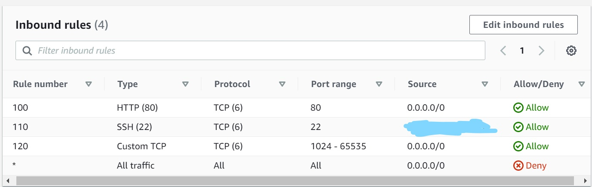

# SRE_AWS_VPC_Networking
## Internet Gateway
## Subnets
### Route Tables
#### Network Access Control List (NACLs)
##### Security Groups

- What is a VPC?
- AWS isolated virtual network - It allows us to control virtual network environment including selection of your own IP address range, we can create multiple subnets within one VPC with specific network configuration. We can use both IPV4 and IPV6 for most resources, it provides security for your services or instances

- What is an Internet Gateway?
- An internet gateway - can transfer communications between an enterprise network and the internet - it allows internet access into the VPC

- What is a Subnet?
- A Subnet is a segmented piece of a larger network - The goal of a subnet to split a large network into a group of smaller, interconnected networks to help minimise traffic - or navigate traffic securely

- Route Table RT
- RT contains set of rules, called routes, that are used to determine where the network traffic from your subnet or gateway is directed

- Network Access Control List (NACL)
- NACLs are stateless - we have to explicitly allow inbound and outbound rules - they are an added layer of security at subnet level

- 4.3 Billion IP address in the world approximately

- Step 1: Create a VPC with IPV valid CDIR block
- `10.0.0.0/16` - next team member to use `10.101.0.0/16` - 10.102.0.0/16 etc (10.106.0.0/16)

- Step 2: Create internet gateway
- 2.1 Attach the IG to your VPC

- Step 3: Create route table
- 3.1 Edit route and insert your IG `target`

- Step 4: Create public subnet
- `10.0.1.0/24`
- 4.1 associate public subnet with our RT

- Step 5: Create public NACLs
- Set inbound and outbound rules for this

- Step 6: Create a security group for our app

## Step 1: Create a VPC with IPV valid CDIR block

In AWS:

- Search for VPC
- Go into 'Your VPC'
- Click 'Create VPC'
- Create a name tag e.g SRE_<'your name'>_vpc
- Create a IPV4 CIDRblock e.g. 10.106.0.0/16
- Click create VPC

## Step 2: Create internet gateway

- Click on 'Internet Gateways' on the side tab
- Create a name tag e.g. SRE_<'name'>_ig
- Click 'Create Internet Gateway'
- Click on Action and click 'Attach VPC'
- Select the VPC we have created (SRE_<'your name'>_vpc)
- Click 'Attach Internet Gateway'

## Step 3: Create subnets
### Create public subnet
- Click on 'Subnets' on the side tab
- Click 'Create Subnet'
- Select your VPC (SRE_<'your name'>_vpc)
- Create a name tag e.g. SRE_<'name'>_public_sb
- Availability Zone is 1a
- Set the IPv4 CIDR block to be the same as for the VPC <B>except</B> change the 3rd optec to 1 instead of 0, e.g. 10.106.1.0/16
- Click 'Create Subnet'

### Create private subnet
- Same as previous except:
- Name tag e.g. SRE_<'name'>_private_sb
- Set the IPv4 CIDR block to be the same as for the VPC <B>except</B> change the 3rd optec to 2 instead of 0, e.g. 10.106.2.0/16
- Click 'Create Subnet'

## Step 4: Create route table

- Click on 'Route Tables' on the side tab
- Click 'Create Route Table'
- Create a name tag e.g. SRE_<'name'>_rt
- Select your VPC (SRE_<'your name'>_vpc)
- Click Create Route Table
- Select the Route Table you have just created
- In the Routes tab, click 'Edit Routes'
- Add your Internet Gateway (SRE_<'name'>_ig)
- Save changes
- In the Subnet associations tab, click 'Edit subnet associations'
- Select the subnets you have created
- Click 'Save Associations'

## Step 5: Create NACLs
### Public NACL
- Click on 'Network ACLs' on the side tab under 'Security'
- Click 'Create Network ACL'
- Create a public NACL
- Create name tag e.g. e.g. SRE_<'name'>_public_nacl
- Select your VPC
- Click 'Create network ACL'
- Select your NACL
- In the Inbound Rules tab, click 'Edit inbound rules'
- Change inbound rules to the following:

