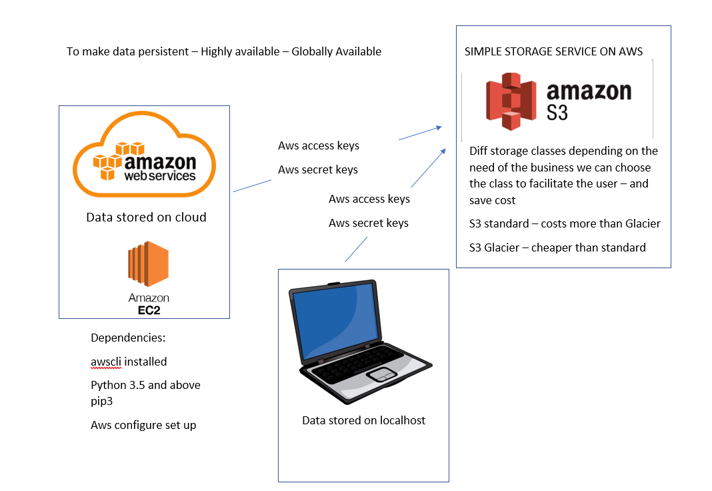

# S3

CRUD - Create, Read, Update, Delete

- ssh into instance

- Install dependencies

<code>sudo apt-get update -y

sudo apt-get upgrade -y

sudo apt-get install python3-pip

python --version

alias python=python3

aws configure </code>

- Enter the secure key details (in excel file)

    - Default region name: eu-west-1

    - Default output format: json

<code>aws s3 ls

aws s3 mb s3://sre<'your name'> </code>

- Should have created a bucket within s3

- Create a README.md file

<code>sudo nano README.md</code>

- Upload file from EC2 to S3

<code>aws s3 cp README.md s3://sresacha </code>

- Remove file from EC2

<code> rm -rf README.md </code>

- Download file from s3 to EC2

<code>aws s3 cp s3://sresacha/README.md README.md </code>

- Sync bucket with a directory

<code>aws s3 sync <'directory path'> s3://sresacha/</code>

- Delete bucket

<code>aws s3 rb s3://sresacha/ --force</code>

## Create a bucket with Python-Boto3
- Install boto3

<code> pip3 install boto3 </code>